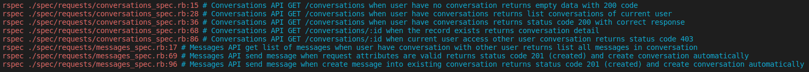

# README

The challenge is make sure when you run `bundle exec rspec`, all result is green (without error):) 

## Version
* Rails v6.1.7
* Ruby v2.7.2
* Database postgreSQL
* Bundle v2.1.4

## Screenshot

Hi, sorry, I have zero experience with ruby and rails so this is as much as I can read and digest in 3 days.

There are some things that I don't understand like how the response_body keep changing json render to hash but expected to be_json_type? is that on purpose? Because I must have missed the be_json_type somewhere.

